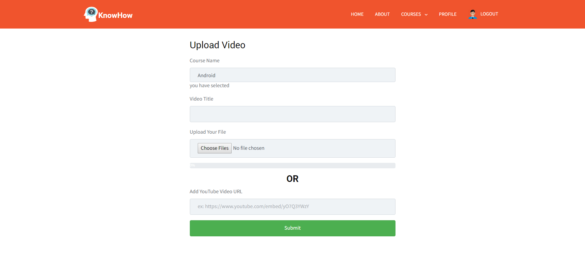
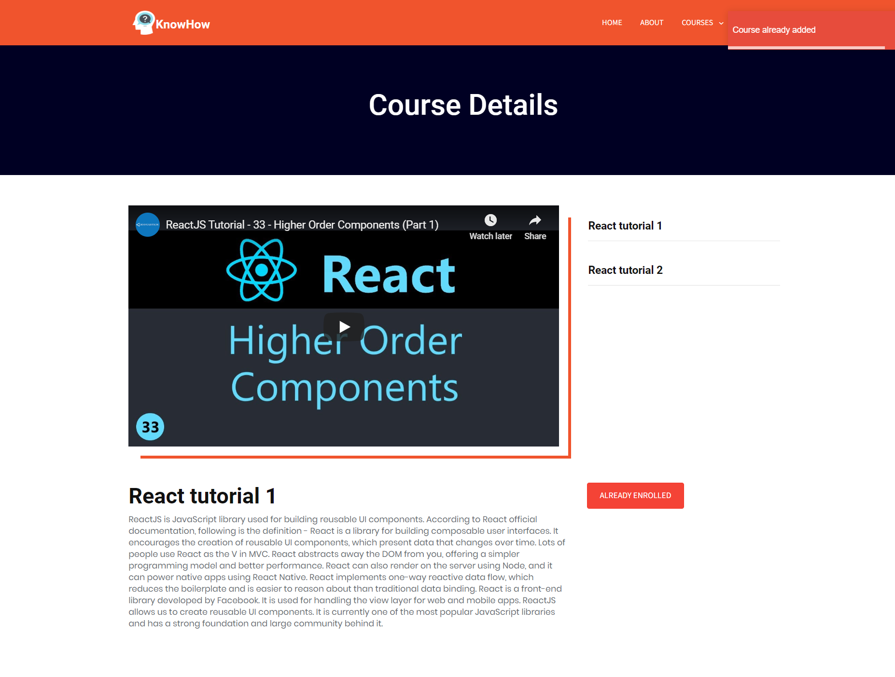
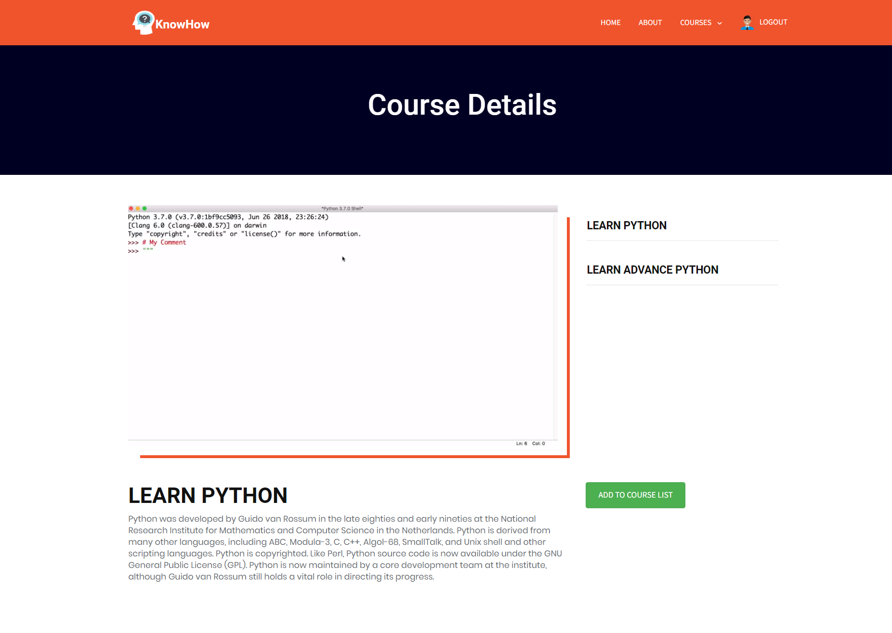
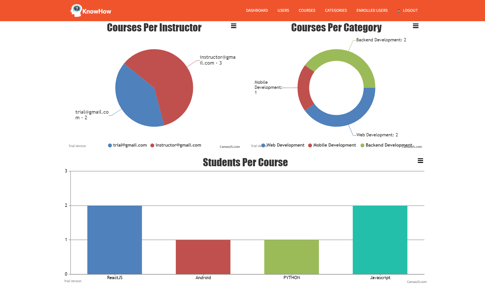

# E-Learning-MERN
It is a E-Learning website which provides functionality of registering in any course and watch its related videos and many other features such as Admin Panel, Instructors related functions etc. 


---

## Quick Start

```bash
# clone repository
https://github.com/savajapurva/E-Learning-MERN.git

# Install dependencies
cd E-Learning-MERN && npm install
cd E-Learning-MERN && cd client && npm install

```
Create account in Mongo Atlas and create cluster. Get your MongoURI by following the instructions and add it in keys.js file which is inside the config folder. 

```
secretOrKey=ANY_SECRET
mongoURI: 'YOUR_URI'

```

To run the development server:

```bash
# the development server runs on port 3000
npm run dev
```

To run production build:

```bash
# create code bundle
npm run build

# run production server
npm run prod
```
---

## Instructor's Portal


---


---



---


---

## Student's Portal


---



---



---

## Admin Portal



---


---


---


---


---

